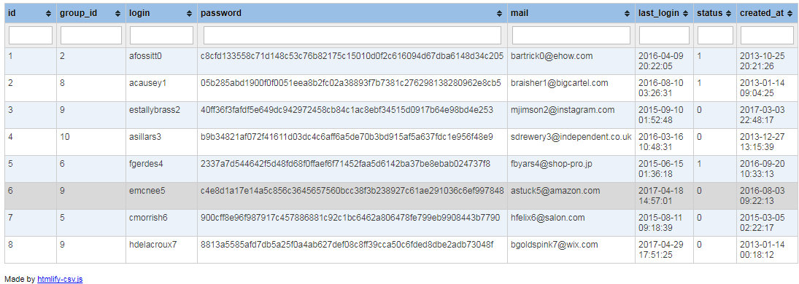

# htmlify-csv.js

This NodeJs module converts a CSV file into an HTML table very easily!

The HTML table generated allows you to filter the columns and sort them.




## Install

Clone this repository:

```
git clone git@github.com:shevabam/htmlify-csv.git
cd htmlify-csv
```

Then run:

```
npm install
```


## Usage

Converts `example.csv` into HTML file, located in `datas` folder:

```
node htmlify-csv convert example.csv
```

Add some options to define the delimiter and to open the generated HTML file in your Web browser:

```
node htmlify-csv convert example.csv --delimiter=";" --show
```

Converts `datas/example.csv` to `datas/example.html` width ";" delimiter, and open output file in your Web browser:

```
node htmlify-csv convert "datas/example.csv" --delimiter=";" --output="datas/example.html" --show
```


## Options

To view all available options, use:

```
node htmlify-csv --help
```


| Param | Description | Default | Example |
| --- | --- | --- | --- |
| --delimiter | CSV delimiter | , | --delimiter=";" |
| --output | Output filename | datas/output.html | --output="file.html" |
| --show | Open HTML output file in browser | false | |
| --port | Server port number | 8090 | --port=1337


## Credits

* [jQuery](https://jquery.com/)
* [tablesorter](https://mottie.github.io/tablesorter/docs/)
* [Caporal.js](https://github.com/mattallty/Caporal.js)
* [babyparse](https://www.npmjs.com/package/babyparse)
